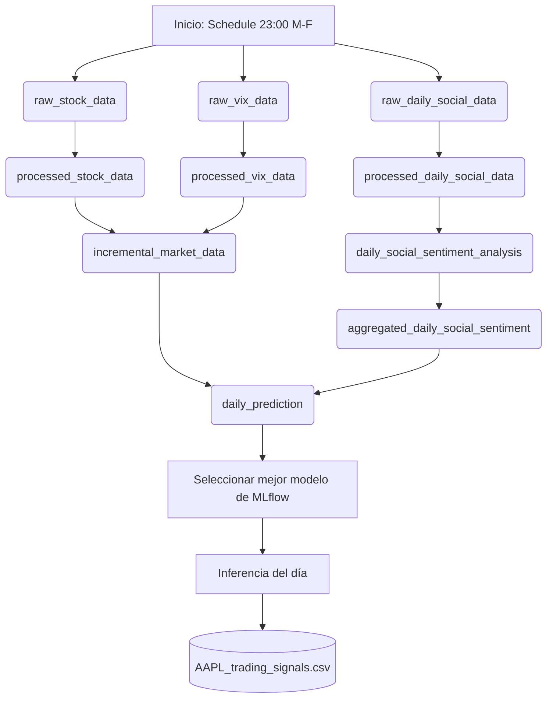

# 🔄 Pipeline de Inferencia y Producción Diaria (AAPL)

Este documento describe la arquitectura, diseño e implementación del pipeline de producción diaria y su planificación (schedule) para obtener las predicciones operativas del ticker `AAPL`.

---

## 🏛️ Arquitectura del Pipeline

El pipeline de producción diaria integra la ingesta incremental de datos financieros de Yahoo Finance, la extracción de posts más relevantes de Bluesky, el análisis de sentimiento mediante Hugging Face Transformers, y la inferencia predictiva seleccionando dinámicamente el modelo con las mejores métricas registrado en **MLflow**.



---

## ⚙️ Componentes del Pipeline

### 1. Ingesta y Procesamiento de Mercado
- **`raw_stock_data` y `raw_vix_data`:** Assets de ingesta que descargan datos de `AAPL` y del índice `^VIX` usando `yfinance`. Poseen tolerancia a ejecuciones de un solo día (si `initial_date == end_date`, agregan un día de forma interna para evitar dataframes vacíos).
- **`processed_stock_data` y `processed_vix_data`:** Normalizan nombres de columnas a minúsculas y limpian nulos.
- **`incremental_market_data`:** Consolida de forma incremental el histórico del mercado en `data/03_features/stock/`, previniendo duplicados y recalculando indicadores técnicos dinámicos (`RSI`, `SMA_10`, `SMA_50`, `volatilidad_10d`) sobre la serie histórica.

### 2. Ingesta y Análisis de Sentimiento (Bluesky)
- **`raw_daily_social_data`:** Descarga los top 300 posts diarios de Bluesky para el término `Apple`.
- **`processed_daily_social_data`:** Normaliza estructuras y aplica filtros de Data Quality.
- **`daily_social_sentiment_analysis`:** Aplica inferencia NLP mediante un pipeline de sentimiento local (configurable desde `.env` mediante `SENTIMENT_MODEL`).
- **`aggregated_daily_social_sentiment`:** Agrupa de forma diaria el sentimiento calculando el volumen, la media de sentimiento y la desviación estándar, persistiendo el incremental en `data/03_features/daily/AAPL_sentiment.csv`.

### 3. Inferencia de Producción (`daily_prediction`)
Este asset centraliza la inteligencia del pipeline de producción:
1. **Unión de Características (Feature Store Local):** Combina el histórico financiero consolidado de stock/VIX con el histórico diario consolidado de sentimiento de Bluesky.
2. **Feature Engineering Inmediato:** Calcula variables cíclicas, temporales e interacciones de sentimiento y volumen.
3. **Selección Dinámica del Mejor Modelo:** Consulta el registro de modelos de MLflow local (`sqlite:///runtime/mlflow/mlflow.db`) para comparar el `accuracy` de las últimas versiones de los 3 modelos candidatos:
   - `Apple_Trading_Model` (Random Forest)
   - `Apple_XGBoost_Model` (XGBoost)
   - `Apple_LSTM_Model` (LSTM)
   El modelo con mayor accuracy es cargado en memoria de forma dinámica.
4. **Scoring Adaptativo:** Aplica preprocesamiento específico al tipo de modelo cargado (incluyendo secuenciación temporal 3D y escalado estándar en el caso del modelo LSTM).
5. **Persistencia Unificada (Append & Deduplicate):** Añade la nueva predicción al archivo histórico [AAPL_trading_signals.csv](file:///home/josandres/Development/unir-grupo6-tfm/data/04_predictions/AAPL_trading_signals.csv), deduplica las fechas repetidas (manteniendo la inferencia más reciente) y lo reordena cronológicamente.

---

## 📅 Planificación (Schedule)

El pipeline de producción está planificado en el archivo [src/definitions.py](file:///home/josandres/Development/unir-grupo6-tfm/src/definitions.py) a través de la función `daily_production_pipeline_schedule`.

### Configuración del Cron
- **Cron:** `0 23 * * 1-5`
- **Frecuencia:** De lunes a viernes a las 23:00 (hora CET/CEST), coincidiendo con el cierre de los mercados financieros estadounidenses.
- **Parámetros Automáticos:** Calcula dinámicamente la fecha actual del sistema en formato `YYYY-MM-DD` y la inyecta como rango temporal a los assets que requieren parámetros de configuración.

```python
@schedule(
    cron_schedule="0 23 * * 1-5",  # De lunes a viernes a las 23:00 (cierre de mercado)
    job=daily_production_pipeline_job,
    name="daily_production_pipeline_schedule",
    description="Ejecuta diariamente el pipeline de producción para AAPL con la fecha actual.",
)
def daily_production_pipeline_schedule(context):
    import datetime
    today_str = datetime.date.today().strftime("%Y-%m-%d")
    
    config_dict = {
        "ticker": "AAPL",
        "name": "Apple",
        "initial_date": today_str,
        "end_date": today_str
    }
    
    return RunConfig(
        ops={
            "raw_stock_data": {"config": config_dict},
            "raw_vix_data": {"config": config_dict},
            "processed_stock_data": {"config": config_dict},
            "processed_vix_data": {"config": config_dict},
            "incremental_market_data": {"config": config_dict},
            "raw_daily_social_data": {"config": config_dict},
            "aggregated_daily_social_sentiment": {"config": config_dict},
            "daily_prediction": {"config": config_dict}
        }
    )
```

---

## 📊 Datos de Prueba y Validación

Durante la ejecución de prueba realizada para el día **`2023-12-15`**, el pipeline arrojó los siguientes resultados registrados en el Log de Dagster:

### Métricas de Modelos Evaluadas desde MLflow
| Modelo Candidato | Métrica de Accuracy | Estado |
| --- | --- | --- |
| `Apple_Trading_Model` (RandomForest) | 0.4129 | Descartado |
| `Apple_XGBoost_Model` (XGBoost) | 0.4478 | Descartado |
| **`Apple_LSTM_Model` (LSTM)** | **0.4541** | **Seleccionado (Ganador)** |

### Resultado de la Inferencia diaria
El modelo LSTM evaluó la serie de indicadores técnicos del día y la combinó con el análisis de sentimiento de los posts de Bluesky, produciendo el siguiente registro en [data/04_predictions/AAPL_trading_signals.csv](file:///home/josandres/Development/unir-grupo6-tfm/data/04_predictions/AAPL_trading_signals.csv):

```csv
date,price_close,predicted_signal,confidence
...
2023-12-14,198.10626220703125,0,0.37552421
2023-12-15,195.35867309570312,0,0.37091783
```

- **Señal operativa (`predicted_signal`):** `0` (Mantener / Vender)
- **Confianza / Probabilidad alcista (`confidence`):** `37.09%` (lo que confirma la predicción bajista al ser menor de 50%).
